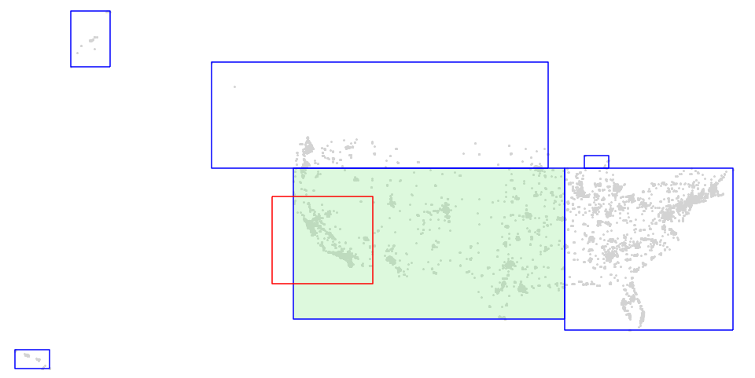
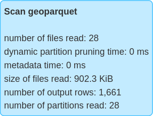

Sedona Spatial operators fully supports Apache SparkSQL query optimizer. It has the following query optimization features:

* Automatically optimizes range join query and distance join query.
* Automatically performs predicate pushdown.

!!! tip
	Sedona join performance is heavily affected by the number of partitions. If the join performance is not ideal, please increase the number of partitions by doing `df.repartition(XXX)` right after you create the original DataFrame.

## Range join

Introduction: Find geometries from A and geometries from B such that each geometry pair satisfies a certain predicate. Most predicates supported by SedonaSQL can trigger a range join.

SQL Example

```sql
SELECT *
FROM polygondf, pointdf
WHERE ST_Contains(polygondf.polygonshape,pointdf.pointshape)
```

```sql
SELECT *
FROM polygondf, pointdf
WHERE ST_Intersects(polygondf.polygonshape,pointdf.pointshape)
```

```sql
SELECT *
FROM pointdf, polygondf
WHERE ST_Within(pointdf.pointshape, polygondf.polygonshape)
```

```sql
SELECT *
FROM pointdf, polygondf
WHERE ST_DWithin(pointdf.pointshape, polygondf.polygonshape, 10.0)
```

Spark SQL Physical plan:

```
== Physical Plan ==
RangeJoin polygonshape#20: geometry, pointshape#43: geometry, false
:- Project [st_polygonfromenvelope(cast(_c0#0 as decimal(24,20)), cast(_c1#1 as decimal(24,20)), cast(_c2#2 as decimal(24,20)), cast(_c3#3 as decimal(24,20)), mypolygonid) AS polygonshape#20]
:  +- *FileScan csv
+- Project [st_point(cast(_c0#31 as decimal(24,20)), cast(_c1#32 as decimal(24,20)), myPointId) AS pointshape#43]
   +- *FileScan csv

```

!!!note
	All join queries in SedonaSQL are inner joins

## Distance join

Introduction: Find geometries from A and geometries from B such that the distance of each geometry pair is less or equal than a certain distance. It supports the planar Euclidean distance calculators `ST_Distance`, `ST_HausdorffDistance`, `ST_FrechetDistance` and the meter-based geodesic distance calculators `ST_DistanceSpheroid` and `ST_DistanceSphere`.

Spark SQL Example for planar Euclidean distance:

*Only consider ==fully within a certain distance==*

```sql
SELECT *
FROM pointdf1, pointdf2
WHERE ST_Distance(pointdf1.pointshape1,pointdf2.pointshape2) < 2
```

```sql
SELECT *
FROM pointDf, polygonDF
WHERE ST_HausdorffDistance(pointDf.pointshape, polygonDf.polygonshape, 0.3) < 2
```

```sql
SELECT *
FROM pointDf, polygonDF
WHERE ST_FrechetDistance(pointDf.pointshape, polygonDf.polygonshape) < 2
```

*Consider ==intersects within a certain distance==*

```sql
SELECT *
FROM pointdf1, pointdf2
WHERE ST_Distance(pointdf1.pointshape1,pointdf2.pointshape2) <= 2
```

```sql
SELECT *
FROM pointDf, polygonDF
WHERE ST_HausdorffDistance(pointDf.pointshape, polygonDf.polygonshape) <= 2
```

```sql
SELECT *
FROM pointDf, polygonDF
WHERE ST_FrechetDistance(pointDf.pointshape, polygonDf.polygonshape) <= 2
```

Spark SQL Physical plan:

```
== Physical Plan ==
DistanceJoin pointshape1#12: geometry, pointshape2#33: geometry, 2.0, true
:- Project [st_point(cast(_c0#0 as decimal(24,20)), cast(_c1#1 as decimal(24,20)), myPointId) AS pointshape1#12]
:  +- *FileScan csv
+- Project [st_point(cast(_c0#21 as decimal(24,20)), cast(_c1#22 as decimal(24,20)), myPointId) AS pointshape2#33]
   +- *FileScan csv
```

!!!warning
	If you use planar euclidean distance functions like `ST_Distance`, `ST_HausdorffDistance` or `ST_FrechetDistance` as the predicate, Sedona doesn't control the distance's unit (degree or meter). It is same with the geometry. If your coordinates are in the longitude and latitude system, the unit of `distance` should be degree instead of meter or mile. To change the geometry's unit, please either transform the coordinate reference system to a meter-based system. See [ST_Transform](Function.md#st_transform). If you don't want to transform your data, please consider using `ST_DistanceSpheroid` or `ST_DistanceSphere`.

Spark SQL Example for meter-based geodesic distance `ST_DistanceSpheroid` (works for `ST_DistanceSphere` too):

*Less than a certain distance==*

```sql
SELECT *
FROM pointdf1, pointdf2
WHERE ST_DistanceSpheroid(pointdf1.pointshape1,pointdf2.pointshape2) < 2
```

*Less than or equal to a certain distance==*

```sql
SELECT *
FROM pointdf1, pointdf2
WHERE ST_DistanceSpheroid(pointdf1.pointshape1,pointdf2.pointshape2) <= 2
```

!!!warning
	If you use `ST_DistanceSpheroid ` or `ST_DistanceSphere` as the predicate, the unit of the distance is meter. Currently, distance join with geodesic distance calculators work best for point data. For non-point data, it only considers their centroids.

## Broadcast index join

Introduction: Perform a range join or distance join but broadcast one of the sides of the join. This maintains the partitioning of the non-broadcast side and doesn't require a shuffle.

Sedona will create a spatial index on the broadcasted table.

Sedona uses broadcast join only if the correct side has a broadcast hint.
The supported join type - broadcast side combinations are:

* Inner - either side, preferring to broadcast left if both sides have the hint
* Left semi - broadcast right
* Left anti - broadcast right
* Left outer - broadcast right
* Right outer - broadcast left

```scala
pointDf.alias("pointDf").join(broadcast(polygonDf).alias("polygonDf"), expr("ST_Contains(polygonDf.polygonshape, pointDf.pointshape)"))
```

Spark SQL Physical plan:

```
== Physical Plan ==
BroadcastIndexJoin pointshape#52: geometry, BuildRight, BuildRight, false ST_Contains(polygonshape#30, pointshape#52)
:- Project [st_point(cast(_c0#48 as decimal(24,20)), cast(_c1#49 as decimal(24,20))) AS pointshape#52]
:  +- FileScan csv
+- SpatialIndex polygonshape#30: geometry, QUADTREE, [id=#62]
   +- Project [st_polygonfromenvelope(cast(_c0#22 as decimal(24,20)), cast(_c1#23 as decimal(24,20)), cast(_c2#24 as decimal(24,20)), cast(_c3#25 as decimal(24,20))) AS polygonshape#30]
      +- FileScan csv
```

This also works for distance joins with `ST_Distance`, `ST_DistanceSpheroid`, `ST_DistanceSphere`, `ST_HausdorffDistance` or `ST_FrechetDistance`:

```scala
pointDf1.alias("pointDf1").join(broadcast(pointDf2).alias("pointDf2"), expr("ST_Distance(pointDf1.pointshape, pointDf2.pointshape) <= 2"))
```

Spark SQL Physical plan:

```
== Physical Plan ==
BroadcastIndexJoin pointshape#52: geometry, BuildRight, BuildLeft, true, 2.0 ST_Distance(pointshape#52, pointshape#415) <= 2.0
:- Project [st_point(cast(_c0#48 as decimal(24,20)), cast(_c1#49 as decimal(24,20))) AS pointshape#52]
:  +- FileScan csv
+- SpatialIndex pointshape#415: geometry, QUADTREE, [id=#1068]
   +- Project [st_point(cast(_c0#48 as decimal(24,20)), cast(_c1#49 as decimal(24,20))) AS pointshape#415]
      +- FileScan csv
```

Note: If the distance is an expression, it is only evaluated on the first argument to ST_Distance (`pointDf1` above).

## Automatic broadcast index join

When one table involved a spatial join query is smaller than a threshold, Sedona will automatically choose broadcast index join instead of Sedona optimized join. The current threshold is controlled by [sedona.join.autoBroadcastJoinThreshold](Parameter.md) and set to the same as `spark.sql.autoBroadcastJoinThreshold`.

## Raster join

The optimization for spatial join also works for raster predicates, such as `RS_Intersects`, `RS_Contains` and `RS_Within`.

SQL Example:

```sql
-- Raster-geometry join
SELECT df1.id, df2.id, RS_Value(df1.rast, df2.geom) FROM df1 JOIN df2 ON RS_Intersects(df1.rast, df2.geom)

-- Raster-raster join
SELECT df1.id, df2.id FROM df1 JOIN df2 ON RS_Intersects(df1.rast, df2.rast)
```

These queries could be planned as RangeJoin or BroadcastIndexJoin. Here is an example of the physical plan using RangeJoin:

```
== Physical Plan ==
*(1) Project [id#14, id#25]
+- RangeJoin rast#13: raster, geom#24: geometry, INTERSECTS,  **org.apache.spark.sql.sedona_sql.expressions.RS_Intersects**
   :- LocalTableScan [rast#13, id#14]
   +- LocalTableScan [geom#24, id#25]
```

## Google S2 based approximate equi-join

If the performance of Sedona optimized join is not ideal, which is possibly caused by  complicated and overlapping geometries, you can resort to Sedona built-in Google S2-based approximate equi-join. This equi-join leverages Spark's internal equi-join algorithm and might be performant given that you can opt to skip the refinement step  by sacrificing query accuracy.

Please use the following steps:

### 1. Generate S2 ids for both tables

Use [ST_S2CellIds](Function.md#st_s2cellids) to generate cell IDs. Each geometry may produce one or more IDs.

```sql
SELECT id, geom, name, explode(ST_S2CellIDs(geom, 15)) as cellId
FROM lefts
```

```sql
SELECT id, geom, name, explode(ST_S2CellIDs(geom, 15)) as cellId
FROM rights
```

### 2. Perform equi-join

Join the two tables by their S2 cellId

```sql
SELECT lcs.id as lcs_id, lcs.geom as lcs_geom, lcs.name as lcs_name, rcs.id as rcs_id, rcs.geom as rcs_geom, rcs.name as rcs_name
FROM lcs JOIN rcs ON lcs.cellId = rcs.cellId
```

### 3. Optional: Refine the result

Due to the nature of S2 Cellid, the equi-join results might have a few false-positives depending on the S2 level you choose. A smaller level indicates bigger cells, less exploded rows, but more false positives.

To ensure the correctness, you can use one of the [Spatial Predicates](Predicate.md) to filter out them. Use this query instead of the query in Step 2.

```sql
SELECT lcs.id as lcs_id, lcs.geom as lcs_geom, lcs.name as lcs_name, rcs.id as rcs_id, rcs.geom as rcs_geom, rcs.name as rcs_name
FROM lcs, rcs
WHERE lcs.cellId = rcs.cellId AND ST_Contains(lcs.geom, rcs.geom)
```

As you see, compared to the query in Step 2, we added one more filter, which is `ST_Contains`, to remove false positives. You can also use `ST_Intersects` and so on.

!!!tip
	You can skip this step if you don't need 100% accuracy and want faster query speed.

### 4. Optional: De-duplicate

Due to the explode function used when we generate S2 Cell Ids, the resulting DataFrame may have several duplicate <lcs_geom, rcs_geom> matches. You can remove them by performing a GroupBy query.

```sql
SELECT lcs_id, rcs_id, first(lcs_geom), first(lcs_name), first(rcs_geom), first(rcs_name)
FROM joinresult
GROUP BY (lcs_id, rcs_id)
```

The `first` function is to take the first value from a number of duplicate values.

If you don't have a unique id for each geometry, you can also group by geometry itself. See below:

```sql
SELECT lcs_geom, rcs_geom, first(lcs_name), first(rcs_name)
FROM joinresult
GROUP BY (lcs_geom, rcs_geom)
```

!!!note
	If you are doing point-in-polygon join, this is not a problem and you can safely discard this issue. This issue only happens when you do polygon-polygon, polygon-linestring, linestring-linestring join.

### S2 for distance join

This also works for distance join. You first need to use `ST_Buffer(geometry, distance)` to wrap one of your original geometry column. If your original geometry column contains points, this `ST_Buffer` will make them become circles with a radius of `distance`.

Since the coordinates are in the longitude and latitude system, so the unit of `distance` should be degree instead of meter or mile. You can get an approximation by performing `METER_DISTANCE/111000.0`, then filter out false-positives.  Note that this might lead to inaccurate results if your data is close to the poles or antimeridian.

In a nutshell, run this query first on the left table before Step 1. Please replace `METER_DISTANCE` with a meter distance. In Step 1, generate S2 IDs based on the `buffered_geom` column. Then run Step 2, 3, 4 on the original `geom` column.

```sql
SELECT id, geom, ST_Buffer(geom, METER_DISTANCE/111000.0) as buffered_geom, name
FROM lefts
```

## Regular spatial predicate pushdown

Introduction: Given a join query and a predicate in the same WHERE clause, first executes the Predicate as a filter, then executes the join query.

SQL Example

```sql
SELECT *
FROM polygondf, pointdf
WHERE ST_Contains(polygondf.polygonshape,pointdf.pointshape)
AND ST_Contains(ST_PolygonFromEnvelope(1.0,101.0,501.0,601.0), polygondf.polygonshape)
```

Spark SQL Physical plan:

```
== Physical Plan ==
RangeJoin polygonshape#20: geometry, pointshape#43: geometry, false
:- Project [st_polygonfromenvelope(cast(_c0#0 as decimal(24,20)), cast(_c1#1 as decimal(24,20)), cast(_c2#2 as decimal(24,20)), cast(_c3#3 as decimal(24,20)), mypolygonid) AS polygonshape#20]
:  +- Filter  **org.apache.spark.sql.sedona_sql.expressions.ST_Contains$**
:     +- *FileScan csv
+- Project [st_point(cast(_c0#31 as decimal(24,20)), cast(_c1#32 as decimal(24,20)), myPointId) AS pointshape#43]
   +- *FileScan csv
```

## Push spatial predicates to GeoParquet

Sedona supports spatial predicate push-down for GeoParquet files. When spatial filters were applied to dataframes backed by GeoParquet files, Sedona will use the
[`bbox` properties in the metadata](https://github.com/opengeospatial/geoparquet/blob/v1.0.0-beta.1/format-specs/geoparquet.md#bbox)
to determine if all data in the file will be discarded by the spatial predicate. This optimization could reduce the number of files scanned
when the queried GeoParquet dataset was partitioned by spatial proximity.

To maximize the performance of Sedona GeoParquet filter pushdown, we suggest that you sort the data by their geohash values (see [ST_GeoHash](../../api/sql/Function.md#st_geohash)) and then save as a GeoParquet file. An example is as follows:

```
SELECT col1, col2, geom, ST_GeoHash(geom, 5) as geohash
FROM spatialDf
ORDER BY geohash
```

The following figure is the visualization of a GeoParquet dataset. `bbox`es of all GeoParquet files were plotted as blue rectangles and the query window was plotted as a red rectangle. Sedona will only scan 1 of the 6 files to
answer queries such as `SELECT * FROM geoparquet_dataset WHERE ST_Intersects(geom, <query window>)`, thus only part of the data covered by the light green rectangle needs to be scanned.



We can compare the metrics of querying the GeoParquet dataset with or without the spatial predicate and observe that querying with spatial predicate results in fewer number of rows scanned.

| Without spatial predicate | With spatial predicate |
| ----------- | ----------- |
|  |  |

Spatial predicate push-down to GeoParquet is enabled by default. Users can manually disable it by setting the Spark configuration `spark.sedona.geoparquet.spatialFilterPushDown` to `false`.
