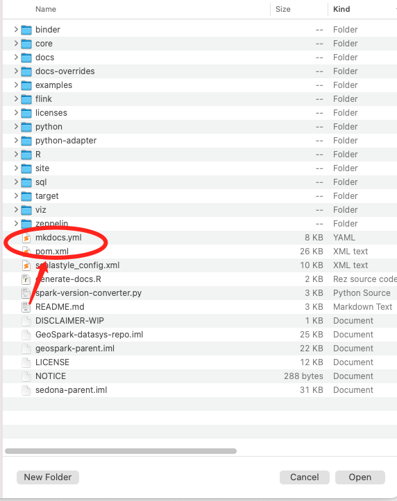
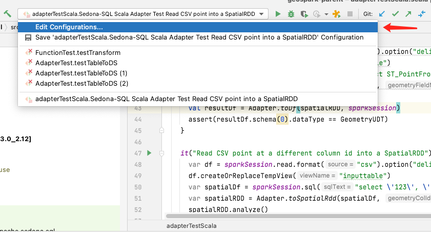
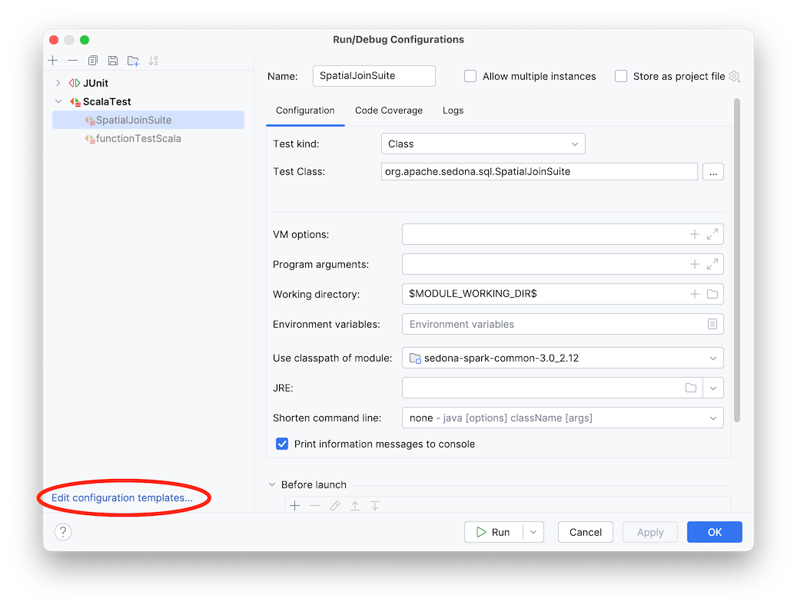
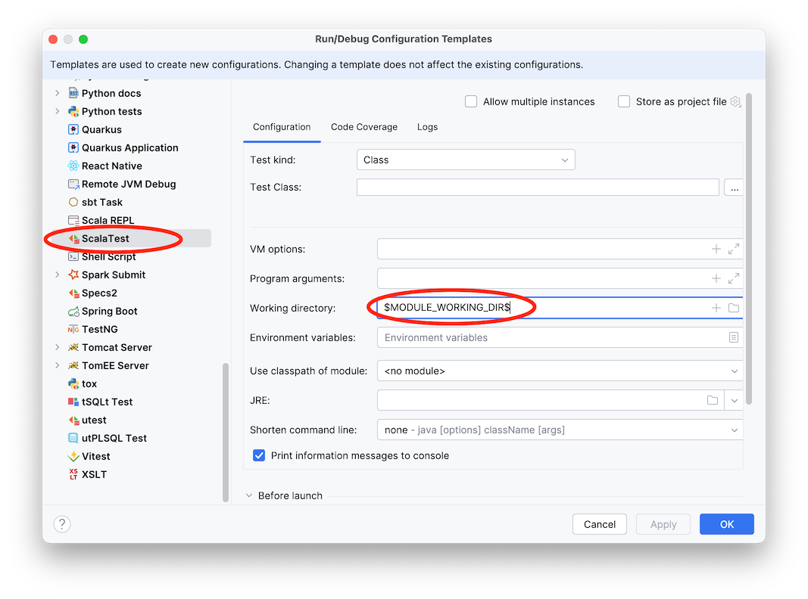
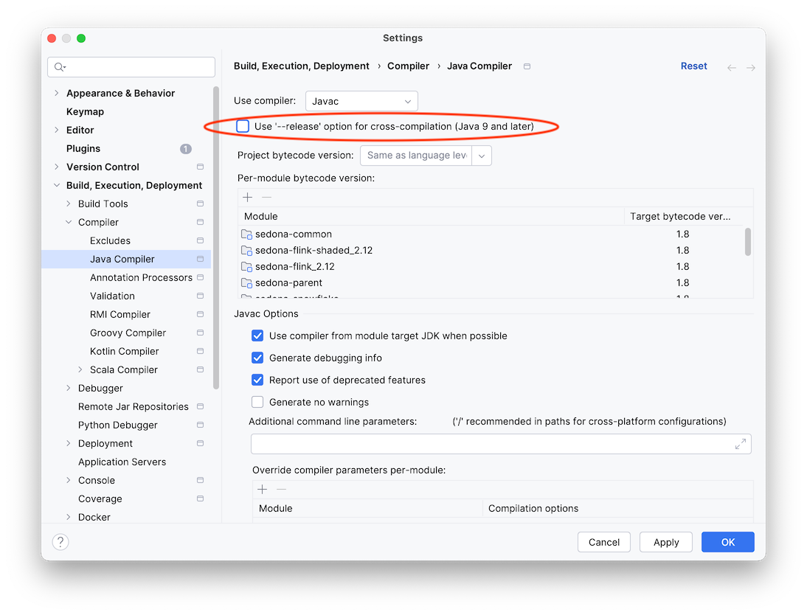

# Develop Sedona

## Scala/Java developers

### IDE

We recommend [Intellij IDEA](https://www.jetbrains.com/idea/) with Scala plugin installed. Please make sure that the IDE has JDK 1.8 set as project default.

### Import the project

#### Choose `Open`


#### Go to the Sedona root folder (not a submodule folder) and choose `open`



#### The IDE might show errors

The IDE usually has trouble understanding the complex project structure in Sedona.


#### Fix errors by changing `pom.xml`

You need to comment out the following lines in `pom.xml` at the root folder, as follows. ==Remember that you should NOT submit this change to Sedona.==

```xml
<!--    <parent>-->
<!--        <groupId>org.apache</groupId>-->
<!--        <artifactId>apache</artifactId>-->
<!--        <version>23</version>-->
<!--        <relativePath />-->
<!--    </parent>-->
```

#### Reload `pom.xml`

Make sure you reload the `pom.xml` or reload the maven project. The IDE will ask you to remove some modules. Please select `yes`.


#### The final project structure should be like this:


### Run unit tests

#### Run all unit tests

In a terminal, go to the Sedona root folder. Run `mvn clean install`. All tests will take more than 15 minutes. To only build the project jars, run `mvn clean install -DskipTests`.
!!!Note
    `mvn clean install` will compile Sedona with Spark 3.3 and Scala 2.12. If you have a different version of Spark in $SPARK_HOME, make sure to specify that using -Dspark command line arg.
    For example, to compile sedona with Spark 3.4 and Scala 2.12, use: `mvn clean install -Dspark=3.4 -Dscala=2.12`

More details can be found on [Compile Sedona](../setup/compile.md)

#### Run a single unit test

In the IDE, right-click a test case and run this test case.


When you run a test case written in Scala, the IDE might tell you that the "Path does not exist" as follows:


Go to `Edit Configuration`



Change the value of `Working Directory` to `$MODULE_WORKING_DIR$`.


Re-run the test case. Do NOT right-click the test case to re-run. Instead, click the button as shown in the figure below.


If you don't want to change the `Working Directory` configuration every time, you can change the default value of `Working Directory`
in the `Run/Debug Configurations` window. Click `Edit configuration templates...` and change the value
of `Working Directory` of ScalaTest to `$MODULE_WORKING_DIR$`.




Now newly created run configurations for ScalaTest will have the correct value set for `Working Directory`.

### IDE Configurations When Using Java 11

If you are using Java 11, you may encounter the following error when running tests:

```
/path/to/sedona/common/src/main/java/org/apache/sedona/common/geometrySerde/UnsafeGeometryBuffer.java
package sun.misc does not exist
sun.misc.Unsafe
```

You can fix this issue by disabling `Use '--release' option for cross-compilation` in the IDE settings.



## Python developers

### IDE

We recommend [PyCharm](https://www.jetbrains.com/pycharm/).

### Run Python tests

#### Run all Python tests

To run all Python test cases, follow steps mentioned [here](../setup/compile.md#run-python-test).

#### Run all Python tests in a single test file

To run a particular Python test file, specify the path of the `.py` file to `pipenv`.

For example, to run all tests in `test_function.py` located in `python/tests/sql/`, use: `pipenv run pytest tests/sql/test_function.py`.

#### Run a single test

To run a particular test in a particular `.py` test file, specify `file_name::class_name::test_name` to the `pytest` command.

For example, to run the test on `ST_Contains` function located in `sql/test_predicate.py`, use: `pipenv run pytest tests/sql/test_predicate.py::TestPredicate::test_st_contains`

### Import the project

## R developers

More details to come.

### IDE

We recommend [RStudio](https://posit.co/products/open-source/rstudio/)

### Import the project
